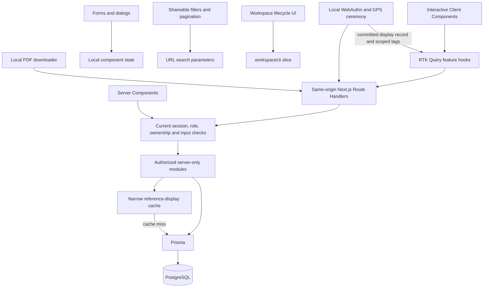

# State management and data flow

The authenticated employee and administration workspaces use Redux Toolkit 2.12 and React Redux 9.3. Interactive resource data belongs to one RTK Query API; existing server modules, Auth.js database sessions, routes, permissions and financial/attendance calculations remain authoritative. See the [audit and baseline](state-audit.md) for the verified defects and preserved invariants, and the [application architecture](architecture.md) for the broader security model.

## Data flow



Server Components call server modules directly. They do not call this application's HTTP endpoints or dispatch Redux actions. Route Handlers obtain current actors from `src/lib/auth.ts`, validate input, and pass server-derived identity/scope to `src/modules`. Shared entry points enforce their own applicable permissions. A client role, office ID or employee ID never grants access.

`src/store/make-store.ts` exports a factory and inferred `AppStore`, `RootState` and `AppDispatch` types. It registers the single `baseApi` reducer/middleware plus the small `workspaceUi` slice. Default serializability checks remain enabled; DevTools are disabled in production. There is no exported singleton store, persistence or duplicated slice of server records.

`src/store/provider.tsx` wraps the authenticated workspace layouts, leaving layouts/pages as Server Components. Each mounted identity boundary creates one stable store using a lazy state initializer. Independent render requests and provider lifetimes receive separate stores. `src/store/hooks.ts` supplies typed hooks. Features inject endpoints into `src/store/api/base-api.ts`, so related resources share invalidation without separate API instances.

## Ownership and migrated screens

| State                                                                                                                               | Owner                                                                                  |
| ----------------------------------------------------------------------------------------------------------------------------------- | -------------------------------------------------------------------------------------- |
| Employee dashboard/history, admin dashboard/attendance, report rows                                                                 | RTK Query attendance/reports endpoints                                                 |
| Departments, offices, networks, shifts, assignments, employees, users, settings, audit/events, device approvals, admin leave review | RTK Query management endpoints                                                         |
| Employee leave and device metadata                                                                                                  | RTK Query leave/attendance endpoints                                                   |
| Drive costs, payment status and cost calculations                                                                                   | RTK Query drive-cost endpoints                                                         |
| Authorized reference options and new-office defaults                                                                                | RTK Query management endpoints; narrow display cache behind the server lookup module   |
| Workspace closing after logout, expiry or account denial                                                                            | `workspaceUi` lifecycle slice, shared by shell, query transport and workspace gate     |
| Search, pagination and applied report/date filters                                                                                  | URL search parameters; debounced searches feed the query arguments                     |
| Unsaved fields, dialog selection, busy/error messages and browser ceremony progress                                                 | Local component state/refs                                                             |
| Employee profile                                                                                                                    | Server Component using `getOwnEmployeeProfile`, shared with its existing JSON endpoint |
| Authentication/session authority                                                                                                    | Auth.js and fresh server guards                                                        |

All ordinary `useResource` consumers were migrated and the obsolete hook was removed. `useQueryView` is a presentation adapter over RTK Query, not another fetch/cache implementation. It uses `currentData`, so a previous employee/filter's result is not displayed under a new selection. Every response-affecting page, search, date, employee, department, office and status filter is included in the relevant query arguments. Pagination stays on the server.

The generic management endpoint retains the existing JSON shape through serializable contracts. Date/time values cross JSON boundaries as strings. Exact drive-cost values remain decimal strings; arithmetic and report totals continue using Prisma Decimal on the server. The client does not recalculate authoritative payments or totals.

## Successful-write invalidation matrix

The matrix follows the nested projections in `management/service.ts`, attendance readiness in `attendance/service.ts`, and leave/holiday/schedule derivation in `reports/service.ts`. Its executable definition is in `src/store/features/management/api.ts` and the other feature API files.

Every management write invalidates its own `Management` list tag, its entity tag when an ID exists, and `Audit`. List invalidation covers changed membership, sort order, page totals and previously absent records. The additional dependencies are:

| Mutation                                        | Additional client lists/reference options                                  | Additional client domains                                                | Next.js reference tag |
| ----------------------------------------------- | -------------------------------------------------------------------------- | ------------------------------------------------------------------------ | --------------------- |
| Employee                                        | Users, assignments, devices, leaves, events; employee options              | Profile, Attendance, Dashboard, Reports, Devices, Leave                  | None                  |
| User/access change                              | Employees, assignments, devices, leaves, events; employee options          | Profile, Attendance, Dashboard, Reports, Devices, Leave; session recheck | None                  |
| Department                                      | Employees, assignments, leaves, events; department options                 | Profile, Dashboard, Reports                                              | `departments:display` |
| Office/policy                                   | Employees, networks, assignments, leaves, holidays, events; office options | Profile, Attendance, Dashboard, Reports                                  | `offices:display`     |
| Shift                                           | Assignments, employees; shift options                                      | Profile, Attendance, Dashboard, Reports                                  | `shifts:display`      |
| Assignment                                      | Employees                                                                  | Profile, Attendance, Dashboard, Reports                                  | None                  |
| Network                                         | Offices                                                                    | Attendance                                                               | None                  |
| Holiday                                         | Own management list                                                        | Attendance, Dashboard, Reports                                           | None                  |
| Device approval/revocation                      | Employees, events                                                          | Devices, Attendance                                                      | None                  |
| Admin leave decision                            | Own management list                                                        | Leave, Attendance, Dashboard, Reports                                    | None                  |
| Global setting                                  | New-office defaults                                                        | Audit                                                                    | None                  |
| Confirmed check-in/out                          | Merge employee day/recent; invalidate attendance HISTORY and event list    | Admin SUMMARY, Reports, Audit                                            | None                  |
| Saved late reason                               | Attendance DAY and HISTORY; event list                                     | Admin SUMMARY, Reports, Audit                                            | None                  |
| Attendance correction                           | Attendance history/entity scopes                                           | Attendance, Dashboard, Reports, Audit                                    | None                  |
| Employee leave creation/cancellation            | Employee/admin leave scopes                                                | Leave, Attendance, Dashboard, Reports, Audit                             | None                  |
| Employee device registration/revocation         | Employee/admin device scopes                                               | Devices, Attendance, Audit                                               | None                  |
| Drive-cost create/edit/delete or payment change | Cost lists/entities and calculations                                       | DriveCosts, Audit                                                        | None                  |

Management lists provide their resource list and entity tags. Devices, leaves, drive costs, audit and events also provide the corresponding shared domain tags, connecting employee and administrator views. History, personal leave/device lists and drive costs provide list/entity scopes. Broader domain invalidation is intentional where dependent totals and many filtered pages must change together.

The profile remains server-rendered: a `Profile` dependency tag does not update Server Component output by itself. Employee/user writes request a session recheck and `router.refresh()` to refresh affected server-rendered identity/profile data. The profile also uses `ProfileRefresh`, a null-rendering client helper that calls `router.refresh()` on retained-route reveal and active, visible, online focus/visibility/reconnect. It skips the already-fresh initial server render, coalesces adjacent events and removes its listeners/timer when hidden or unmounted. It never fetches the profile API or stores profile data in Redux. Ordinary query mutations use tags; they do not also call manual refetch after success. Explicit reconciliation reads after uncertain failures are a separate case.

Invalidation applies to the current browser store only. Other browsers observe changes through their own refresh/focus/reconnect/polling behavior. There is no instantaneous cross-user push or cross-tab sharing of private query records.

## Freshness and navigation

| Resource/view                                                                                         | Active freshness                                                                                      | Unused cache retention |
| ----------------------------------------------------------------------------------------------------- | ----------------------------------------------------------------------------------------------------- | ---------------------- |
| Employee dashboard, administrator dashboard, administrator attendance view                            | Mount/reveal, focus, reconnect, manual refresh and 60-second polling                                  | 60 seconds             |
| Attendance history, management tables, leave, devices, ordinary report view, drive lists/calculations | Mount/reveal, focus, reconnect, manual refresh; no interval polling                                   | 60 seconds             |
| Reference options                                                                                     | Mount/reveal, focus/reconnect, relevant successful writes; retry control on error                     | 120 seconds            |
| New-office defaults                                                                                   | Explicit lazy query when opening the form; invalidated by setting writes                              | 60 seconds             |
| PDF exports                                                                                           | Explicit download only                                                                                | No Redux retention     |
| Employee profile                                                                                      | Server navigation; retained-route reveal and active focus/visibility/reconnect via `router.refresh()` | No RTK subscription    |

`keepUnusedDataFor` is eviction time after the last subscription ends. It is not a freshness guarantee for subscribed data. `useFreshness` explicitly enables `refetchOnMountOrArgChange`, focus and reconnect behavior. It accounts for Next.js/React Activity retaining route state: hidden effects/subscriptions are released, and restored subscriptions request fresh data. This behavior has component coverage using Activity and browser coverage for a route reveal.

`NEXT_PUBLIC_ATTENDANCE_POLL_MS` configures the live-view interval, defaulting to `60000`; the implementation clamps finite values to a minimum of `15000` milliseconds and falls back to 60 seconds for invalid values. As a public Next.js build variable, set it before building the client bundle. Only the three live views use this interval. Polling is disabled while the document is hidden/offline, and `skipPollingIfUnfocused` is enabled. Browser listeners are registered per provider and removed on cleanup.

The UI distinguishes initial loading from background fetching and shows refresh failures while retaining permitted current-filter data. It does not call cached or failed-to-refresh information live. A 401/403 response suppresses restricted cached display data instead of showing it with an error banner.

Dashboard queries have no client-owned "today" date that could become stuck at midnight. Each server read computes the current shift/office date from server time and configured timezones, including overnight shifts. A visible dashboard updates after its next poll, focus/reconnect or manual refresh; it is not guaranteed to switch at the exact midnight millisecond. Hidden/offline views catch up when active again.

## Authentication lifecycle

The server rechecks the persisted, unexpired database session and active Google-bound user for protected access. `requireUser()` also returns the selected session expiry as an ISO string. Layouts seed Auth.js `SessionProvider` with the safe ID/role/session-row-ID/expiry summary, preserving server-rendered children and hydration consistency. This summary is not an authentication credential, and is not copied into Redux. Session cookies, bearer session tokens, Google account subjects and OAuth tokens stay out of Redux.

The client rechecks Auth.js on mount, window focus, the existing Auth.js cross-tab broadcast mechanism, and reconnect. Identity matching includes user ID, role and session row ID. A mismatch hides the old workspace and replaces the document, removing retained Server Component/Activity trees as well as client state. Stores are keyed by that identity tuple.

Signing out closes the workspace before invoking Auth.js sign-out. `clearWorkspaceData` aborts tracked queries/mutations and resets the API state; provider cleanup does the same. The base query rejects new operations on a closed workspace and fences responses that arrive after closure. An abort cannot undo a write already committed by the server, so mutations are never automatically replayed.

HTTP 401 closes the workspace as expired and redirects to login. Account-level 403 codes (`USER_INACTIVE`, `USER_NOT_AUTHORIZED`) close it as forbidden. An ordinary resource-level 403 hides that resource's cached data and leaves a safe permission error without a global reset/refetch loop. Employee/user mutations signal an Auth.js recheck and server refresh because identity/access may have changed. Coordination events contain no private payloads.

Auth.js owns cross-tab logout coordination; no second identity protocol or token store was added. Detection of server revocation is bounded by the next request/session check. A disconnected or inactive browser cannot be promised immediate revocation detection; every server operation continues to enforce current authorization.

## Requests, errors and sensitive exceptions

`base-query.ts` uses same-origin cookies, `cache: "no-store"`, abort signals and a 30-second request timeout. It unwraps the existing `{ success, data }` envelope into serializable DTOs and normalizes status/code/message/field errors. Network, timeout, validation, conflict, forbidden, unauthenticated and rate-limit outcomes remain distinguishable. `Retry-After` is retained when supplied. No automatic read or mutation retry loop is installed; users can explicitly refresh. Auth.js database sessions do not need an OAuth refresh-token loop.

Writes disable duplicate submissions using pending state and ref guards. Attendance, corrections, approval, leave and financial actions do not claim completion before confirmation. After an ambiguous network/timeout/malformed-response/5xx failure, the relevant screen reads authoritative state before allowing another attempt; if that read fails, its reconciliation gate remains closed. Successful writes use tag-driven refresh; attendance first merges its committed display result and then invalidates only dependent views. Attendance recovery also verifies that the intended action is present, rather than treating any successful GET as confirmation. If a Next.js tag expiry call throws after commit, the API still reports the completed write, logs only safe resource metadata and bypasses that reference cache on the process until expiry succeeds.

The intentional exceptions are:

- OAuth stays in Auth.js. The profile stays server-rendered through the authorized employee module; its freshness helper refreshes that server output without a duplicate profile API subscription.
- WebAuthn registration/authentication and precise GPS live only in `src/lib/client/attendance-ceremony.ts` and the focused `request.ts` helper. Raw assertions, challenges and location evidence never become Redux mutation arguments or actions. Workspace/Activity cleanup aborts pending ceremonies and checks cancellation before any subsequent evidence submission. Each attempt obtains a new challenge; the helper never retries a consumed challenge. After the attendance transaction commits, the UI dispatches an allowlisted attendance display record into the existing employee-day cache, preserving employee/office/shift/network/device metadata and updating recent records by the returned ID/date. The confirmation path does not wait for another dashboard GET. An older running day-query thunk is aborted and settled locally before the merged cache is upserted, so a late transport response cannot overwrite confirmation. Queries started after the commit may complete normally. Scoped invalidation refreshes HISTORY, admin SUMMARY, attendance events, Reports and Audit; DAY retains mount/focus/reconnect/manual/polling freshness. See [attendance performance](attendance-performance.md) for permission handling, timings and validation.
- `PdfDownloadButton` performs the authorized no-store fetch locally. Blob data and object URLs stay outside Redux; temporary links are removed and URLs revoked. Unmount/logout aborts pending downloads and prevents late responses from starting a download. Auth failures still notify the workspace lifecycle boundary.

Server response boundaries use attendance/device display projections. Corrections return safe attendance fields, and audit/event display snapshots redact verification evidence without modifying stored audit records. These protections are important because RTK Query stores successful DTOs in browser memory.

## Server cache, deployment and rollback

`next.config.ts` retains Cache Components and the `referenceDisplay` profile (`stale: 30`, `revalidate: 300`, `expire: 900`, in seconds). The only persistent data-cache function caches the first 100 ID/name options plus total count for departments, offices and shifts. Authorization occurs before entering that cache. The current permission matrix gives all authorized administrators the same reference scope; employee choices and arbitrary searches/pages stay dynamic.

Sessions, authorization decisions, attendance eligibility, operational policy/device reads, authoritative attendance and reports are never persistently cached on the server. HTTP `no-store` prevents HTTP cache storage; RTK Query's explicit in-memory application cache is separate. `public/sw.js` has no fetch cache or background mutation queue.

The supplied systemd/Nginx configuration describes one Node process. Actual deployed topology was not inspected. For multiple workers/replicas without coordinated tag invalidation, set `REFERENCE_DISPLAY_CACHE=disabled` in every worker so reference reads go directly to PostgreSQL. No Redis, remote cache or other infrastructure is required. Direct database edits bypass both application invalidation paths; use application mutations, expect the configured label expiry, or disable that small display cache as appropriate.

This refactor requires no schema migration or stored-data conversion. Existing migrations were applied only to a disposable local PostgreSQL test database. No live infrastructure, process or database was changed. Rollback consists of reverting this application/dependency change and deploying the previous compatible bundle through the normal deployment process; preserve the focused authorization and sensitive-response fixes if rolling back only Redux. Do not revert unrelated concurrent feature files or their migrations as part of this rollback.

## Test commands and verification record

Install from the existing lockfile and run the ordinary checks:

```sh
pnpm install --frozen-lockfile
pnpm lint
pnpm typecheck
pnpm test
pnpm db:validate
pnpm db:generate
pnpm build
git diff --check
```

Without `TEST_DATABASE_URL`, PostgreSQL-specific suites intentionally skip; unit mocks are not evidence for row locks, constraints, triggers or transaction isolation. For those checks, configure/export `TEST_DATABASE_URL` to an explicitly disposable, non-production database with `test` in its database name. Check that target before running the following migration command. Do not use a production connection or reset a shared database.

```sh
: "${TEST_DATABASE_URL:?Set an isolated non-production PostgreSQL test database}"
DATABASE_URL="$TEST_DATABASE_URL" pnpm db:migrate
TEST_DATABASE_URL="$TEST_DATABASE_URL" pnpm test
TEST_DATABASE_URL="$TEST_DATABASE_URL" pnpm test:e2e
```

With `TEST_DATABASE_URL` set, Vitest runs test files sequentially to avoid unrelated suites colliding through PostgreSQL SERIALIZABLE predicate locks. Concurrency tests still execute simultaneous operations inside their own suites. Run the Vitest and Playwright database suites separately, not concurrently against the same test database.

Playwright starts a separate development server on localhost port 3100 using `.next-e2e`; leave that port free. Its fixtures create ordinary users and database sessions only in the isolated database; the production application has no test authentication endpoint. Browser dependencies can be installed with `pnpm exec playwright install chromium` when needed.

Focused regression commands:

```sh
pnpm exec vitest run tests/store.test.ts tests/store-lifecycle.test.ts tests/management-query.test.ts tests/employee-drive-query.test.ts tests/attendance-client.test.ts
pnpm exec vitest run tests/server-entrypoints.test.ts tests/server-display-boundaries.test.ts tests/api.test.ts tests/cache-invalidation.test.ts
TEST_DATABASE_URL="$TEST_DATABASE_URL" pnpm exec playwright test tests/e2e/state-management.spec.ts
```

Coverage includes independent stores, stable provider/hydration behavior, Activity cleanup and reveal, hidden/offline polling, deduplication, filter-aware keys, dependent invalidation, 401/403 handling, late-response fencing, sensitive ceremony boundaries, two-tab Auth.js logout, revoked-session detection, authorization and safe server DTOs. Existing PostgreSQL suites cover actual attendance concurrency, challenge replay, immutable history, corrections and Decimal calculations.

The baseline and its exact results are recorded in [state-audit.md](state-audit.md). The older [verification record](verification.md) describes earlier work and is not evidence that this refactor passed. Final commands/results, including any blocked checks, must be recorded below after the final workspace is verified. Real Google consent, physical passkeys/GPS/network behavior and the live deployment remain environment acceptance checks.

### Final verification

Verification ran in the shared workspace and in a frozen verification copy at `/tmp/attendance-rtk-verify.ygixpf7o`. The copy contains this refactor with the original attendance schema; concurrent daily-expense feature code/schema work was excluded without changing the shared worktree. Dependencies were installed from the same lockfile with `pnpm install --offline --frozen-lockfile`. Browser-test URLs/port in the copy were changed from 3100 to 3101 because the concurrent task used 3100.

A new temporary PostgreSQL 18.6 cluster listened only on `127.0.0.1:55481`, with database `attendance_rtk_test` and test-only local authentication. Existing eight migrations were applied with `DATABASE_URL='postgresql://test_runner@127.0.0.1:55481/attendance_rtk_test' pnpm db:migrate`. The configured production/Neon connection was never used for migrations or tests.

| Command                                                                                          | Final result                                                | Scope                                                                               |
| ------------------------------------------------------------------------------------------------ | ----------------------------------------------------------- | ----------------------------------------------------------------------------------- |
| `pnpm lint`                                                                                      | Passed, no lint errors                                      | Shared workspace and verification copy                                              |
| `pnpm typecheck`                                                                                 | Passed                                                      | Shared workspace and verification copy                                              |
| `pnpm db:validate`                                                                               | Passed                                                      | Shared workspace and original-schema verification copy                              |
| `pnpm build`                                                                                     | Passed; includes `prisma generate` and optimized Next build | Shared workspace and verification copy                                              |
| `pnpm test` without a database variable                                                          | 457 passed, 53 skipped in 38 files                          | Shared workspace, including concurrent feature unit tests; DB skips are intentional |
| `TEST_DATABASE_URL='postgresql://test_runner@127.0.0.1:55481/attendance_rtk_test' pnpm test`     | 423 passed in 34 files, no skips                            | Frozen refactor copy, real PostgreSQL                                               |
| `TEST_DATABASE_URL='postgresql://test_runner@127.0.0.1:55481/attendance_rtk_test' pnpm test:e2e` | 28 passed (49.8 seconds)                                    | Frozen refactor copy, browser port 3101, real PostgreSQL                            |
| `git diff --check`                                                                               | Passed                                                      | Shared workspace                                                                    |

Browser coverage includes both PDF download flows, exact totals and pagination, route reveals, two-tab logout with a delayed old response, server-side session revocation, optional employee profiles, role restrictions, and attendance workflows. The temporary PostgreSQL cluster was stopped after verification.

Earlier failures were investigated and resolved: new test fixtures needed the selected session expiry, background status messages required a precise success locator, and the PDF fixture needed the existing employee search when lookup options exceed 100. The revocation test now deletes its fixture session at the next actual protected request, avoiding a race where Auth.js correctly detected expiry before the test could click Refresh. Parallel database suites caused real SERIALIZABLE conflicts between unrelated fixtures; database-enabled Vitest now runs files sequentially while its explicit concurrency tests still race requests. Early whole-workspace checks were also interrupted by unfinished concurrent daily-expense modules and stale generated route types; that unrelated source was preserved, and subsequent whole-workspace checks passed.

`pnpm peers check` still reports the pre-existing Auth.js optional SimpleWebAuthn v9 peer expectations against the installed v14 packages. No major dependency was changed to hide those warnings. Node emitted experimental Web Crypto/ML-DSA warnings during tests, and Next development tests emitted informational cache-bypass warnings. No live Google consent, physical authenticator/GPS behavior or deployment was verified.

Implementation references: [Redux Toolkit App Router guidance](https://redux-toolkit.js.org/usage/nextjs), [RTK Query listener cleanup](https://redux-toolkit.js.org/rtk-query/api/setupListeners), and the installed Next.js 16.3.5 guides under `node_modules/next/dist/docs/`.
